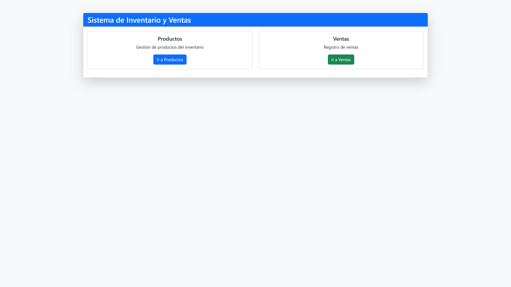
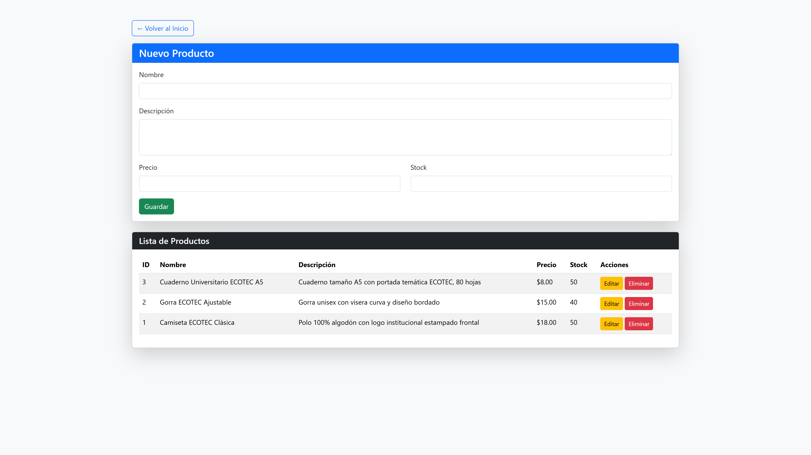
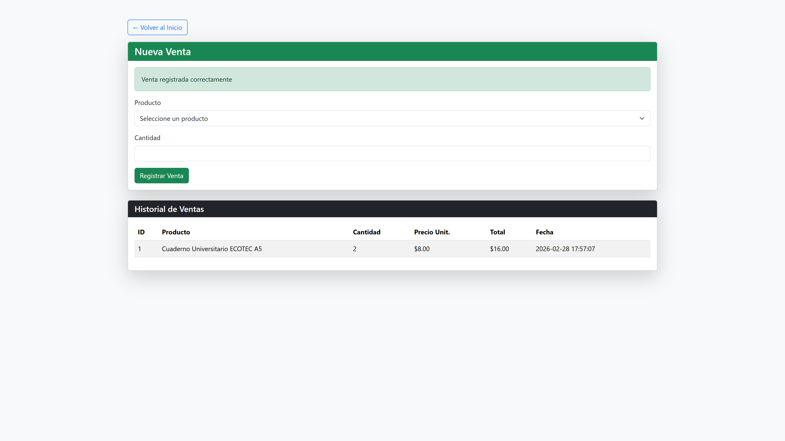

# Sistema de Inventario y Ventas

Sistema web para gestión de productos y registro de ventas desarrollado en PHP con MySQL.

## Tecnologías

- PHP 7.4+
- MySQL 5.7+
- Bootstrap 5.3.2
- Servidor web (Apache/XAMPP/WAMP)

## Requisitos

- PHP 7.4 o superior
- MySQL 5.7 o superior
- Servidor web con soporte PHP (XAMPP, WAMP, LAMP)
- Navegador web moderno

## Instalación Tradicional

1. Clonar el repositorio:
```bash
git clone https://github.com/dmoranp/ecotec-inventory-sales.git
```

2. Copiar el proyecto a la carpeta del servidor web:
```bash
# En XAMPP: C:/xampp/htdocs/inventario-ventas
# En WAMP: C:/wamp64/www/inventario-ventas
```

3. Crear la base de datos ejecutando el script SQL:
```bash
mysql -u root -p < database/inventario.sql
```
O importar `database/inventario.sql` desde phpMyAdmin.

4. Configurar la conexión en `config/database.php` si es necesario:
```php
$host = "localhost";
$user = "root";
$pass = "";
$db = "inventario";
```

5. Acceder desde el navegador:
```
http://localhost/inventario-ventas/public/
```

## Instalación con Docker

1. Clonar el repositorio:
```bash
git clone https://github.com/dmoranp/ecotec-inventory-sales.git
cd ecotec-inventory-sales
```

2. Copiar el archivo de configuración y modificar las variables:
```bash
cp .env.example .env
```

3. Editar `.env` con tus credenciales:
```env
DB_HOST=db
DB_USER=root
DB_PASS=tu_password_seguro
DB_NAME=inventario

MYSQL_ROOT_PASSWORD=tu_password_seguro
MYSQL_DATABASE=inventario
```

4. Crear las redes externas (si no existen):
```bash
docker network create proxy_network
docker network create inventario_network
```

5. Levantar los contenedores:
```bash
docker compose up -d --build
```

6. La base de datos se inicializa automáticamente con el script SQL.

7. Configurar el proxy reverso para apuntar al contenedor `ecotec_inventario_web` en el puerto 80.

## Estructura del Proyecto

```
/inventario-ventas
├── /config
│   └── database.php          # Conexión a base de datos
├── /models
│   ├── Producto.php          # Modelo de productos
│   └── Venta.php             # Modelo de ventas
├── /controllers
│   ├── ProductoController.php
│   └── VentaController.php
├── /services
│   └── VentaService.php      # Lógica de negocio de ventas
├── /public
│   ├── index.php             # Página principal
│   ├── productos.php         # CRUD de productos
│   └── ventas.php            # Registro de ventas
└── /database
    └── inventario.sql        # Script de base de datos
```

## Base de Datos

El script `database/inventario.sql` crea:

**Tabla `productos`:**
| Campo | Tipo | Descripción |
|-------|------|-------------|
| id | INT | Clave primaria |
| nombre | VARCHAR(100) | Nombre del producto |
| descripcion | TEXT | Descripción |
| precio | DECIMAL(10,2) | Precio unitario |
| stock | INT | Cantidad en inventario |
| created_at | TIMESTAMP | Fecha de creación |

**Tabla `ventas`:**
| Campo | Tipo | Descripción |
|-------|------|-------------|
| id | INT | Clave primaria |
| producto_id | INT | FK a productos |
| cantidad | INT | Cantidad vendida |
| precio_unitario | DECIMAL(10,2) | Precio al momento de venta |
| total | DECIMAL(10,2) | Total de la venta |
| created_at | TIMESTAMP | Fecha de venta |

## Módulos

### Productos (CRUD)
- Crear producto con validaciones
- Listar todos los productos
- Editar producto existente
- Eliminar producto

### Ventas
- Selección de producto con stock visible
- Validación de stock disponible
- Descuento automático de inventario
- Historial de ventas

## Capturas

### Página Principal


### Gestión de Productos


### Registro de Ventas


## Validaciones

- **Nombre**: Obligatorio, mínimo 2 caracteres
- **Precio**: Mayor a 0
- **Stock**: Mayor o igual a 0, no permite negativos
- **Ventas**: Valida stock disponible antes de registrar

---

## Nota del Estudiante

La implementación con Docker fue agregada como un **plus adicional** para facilitar el despliegue del proyecto en diferentes entornos, permitiendo una configuración rápida y reproducible sin necesidad de instalar dependencias manualmente.
